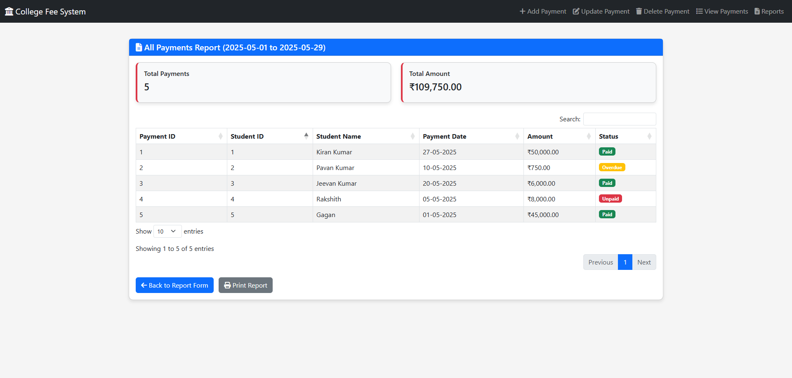

# College Fee Payment System

**Subject Name**: Advanced Java  
**Subject Code**: BCS613D  
**Name**: Kiran Kumar  
**USN**: 4AL22CS078  
**Sem/Section**: VI/B  


A web-based application to manage student fee payments, built with Java Servlets, JSP, MySQL, and Tailwind CSS. The system supports adding, updating, deleting, and viewing fee payments, along with generating reports for overdue payments, non-paid students, and total collections.

## Table of Contents
- [Overview](#overview)
- [Features](#features)
- [Technologies](#technologies)
- [Database Schema](#database-schema)
- [Project Structure](#project-structure)
- [Installation](#installation)
- [Usage](#usage)
- [Screenshots](#screenshots)


## Overview
The **College Fee Payment System** streamlines the management of student fee payments for college administrators. It provides a user-friendly interface to record fee payments, update records, delete entries, and view payment histories. The system also generates reports to track overdue payments, identify non-paying students within a date range, and calculate total fee collections. Built using the MVC architecture, it ensures scalability and maintainability.

## Features
### Modules
- **FeeAdd**: Record new fee payments with Student ID, Name, Date, Amount, and Status (Paid, Unpaid, Overdue).
- **FeeUpdate**: Modify existing payment details.
- **FeeDelete**: Remove payment records by Payment ID.
- **FeeDisplay**: View all payment records in a tabular format.
- **Reports**:
  - List students with overdue payments.
  - Identify students who haven’t paid in a specified period.
  - Calculate total fee collections over a date range.

## Technologies
- **Backend**: Java Servlets, JDBC
- **Frontend**: JSP, Tailwind CSS
- **Database**: MySQL (via MySQL Connector/J 9.3.0)
- **Server**: Apache Tomcat 9.0.105
- **IDE**: Eclipse Enterprise
- **Build Tool**: Manual build in Eclipse
- **Dependencies**:
  - MySQL Connector/J 9.3.0
  - JSTL 1.2 (`jstl.jar`, `standard.jar`)

## Database Schema
The system uses a MySQL database named `collegefeedb` with one table:

```sql
CREATE TABLE FeePayments (
    PaymentID INT PRIMARY KEY AUTO_INCREMENT,
    StudentID INT,
    StudentName VARCHAR(100),
    PaymentDate DATE,
    Amount DECIMAL(10,2),
    Status VARCHAR(20) -- Paid, Unpaid, Overdue
);
```

## Project Structure
```
CollegeFeeWebApp/
├── WebContent/
│   ├── index.jsp              # Home page with navigation
│   ├── feepaymentadd.jsp      # Add fee payment form
│   ├── feepaymentupdate.jsp   # Update payment form
│   ├── feepaymentdelete.jsp   # Delete payment form
│   ├── feepaymentdisplay.jsp  # Display all payments
│   ├── reports.jsp            # Reports landing page
│   ├── report_form.jsp        # Report selection form
│   └── report_result.jsp      # Report results
├── src/
│   ├── com/
│   │   ├── dao/
│   │   │   └── FeePaymentDAO.java        # Database operations
│   │   ├── model/
│   │   │   └── FeePayment.java           # Payment model
│   │   └── servlet/
│   │       ├── AddFeePaymentServlet.java      # Add payment
│   │       ├── UpdateFeePaymentServlet.java   # Update payment
│   │       ├── DeleteFeePaymentServlet.java   # Delete payment
│   │       ├── DisplayFeePaymentsServlet.java # Display payments
│   │       ├── ReportServlet.java            # Generate reports
│   │       └── ReportCriteriaServlet.java    # Report form
└── WEB-INF/
    ├── lib/
    │   ├── mysql-connector-j-9.3.0.jar
    │   ├── jstl.jar
    │   ├── standard.jar
    └── web.xml                        # Servlet mappings
```

## Installation
### Prerequisites
- Java JDK 8 or higher
- Apache Tomcat 9.0.105
- MySQL (via XAMPP or standalone)
- Eclipse IDE for Enterprise Java Developers
- Git (optional, for cloning)

### Steps
1. **Clone the Repository**:
   ```bash
   git clone https://github.com/DeltaK17/College_Fee_Payment_System.git
   cd College_Fee_Payment_System
   ```

2. **Set Up the Database**:
   - Start MySQL (e.g., via XAMPP).
   - Create the database:
     ```sql
     CREATE DATABASE collegefeedb;
     ```
   - Create the `FeePayments` table:
     ```sql
     CREATE TABLE FeePayments (
         PaymentID INT PRIMARY KEY AUTO_INCREMENT,
         StudentID INT,
         StudentName VARCHAR(100),
         PaymentDate DATE,
         Amount DECIMAL(10,2),
         Status VARCHAR(20)
     );
     ```
   - Add sample data:
     ```sql
     INSERT INTO FeePayments (StudentID, StudentName, PaymentDate, Amount, Status) VALUES
         (1, 'Kiran Kumar', '2025-05-27', 50000.00, 'Paid'),
         (2, 'Pavan Kumar', '2025-05-10', 750.00, 'Overdue'),
         (3, 'Jeevan Kumar', '2025-05-20', 6000.00, 'Paid'),
         (4, 'Rakshith', '2025-05-05', 8000.00, 'Unpaid'),
         (5, 'Gagan', '2025-05-01', 45000.00, 'Paid');
     ```

3. **Configure Eclipse**:
   - Import the project: **File > Import > Existing Projects into Workspace**.
   - Add Tomcat: **Window > Preferences > Server > Runtime Environments**.
   - Add dependencies to `WEB-INF/lib` and build path:
     - `mysql-connector-j-9.3.0.jar`
     - `jstl.jar`
     - `standard.jar`

4. **Deploy to Tomcat**:
   - In **Servers** view, add `College_Fee_Payment_System` to Tomcat.
   - Ensure port 8080 is free (or configure 8081 in `server.xml`).
   - Start Tomcat: **Servers** > **Start**.

5. **Access the Application**:
   - Open: `http://localhost:8080/College_Fee_Payment_System/`

## Usage
- **Home Page**: `index.jsp` provides links to all modules.
- **Add Payment**: Navigate to `feepaymentadd.jsp`, enter details (e.g., StudentID=1, StudentName="Kiran Kumar", PaymentDate="2025-05-27", Amount=50000.00, Status="Paid"), and submit.
- **Update Payment**: Use `feepaymentupdate.jsp` to edit records by PaymentID.
- **Delete Payment**: Enter PaymentID in `feepaymentdelete.jsp` to remove records.
- **View Payments**: Access `/displayFeePayments` to see all records in `feepaymentdisplay.jsp`.
- **Reports**:
  - Go to `/reportCriteria` (`report_form.jsp`).
  - Select report type (Overdue, Non-Paid, Total Collection) and date range.
  - View results in `report_result.jsp`.

<a id="screenshots"></a>
## 🖼️ Screenshots

### 🏠 Home Page


### ➕ Add Fee Payment


### 🆕 Update Fee Payment


### ❌ Delete Fee Payment


### 📋 Display Fee Payments


### 📊 Report Form




